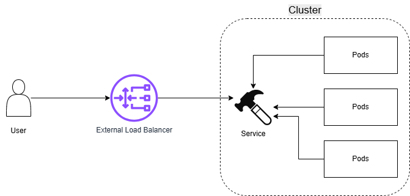

# AWS Notes: EKS (Elastic Kubernetes Service)

## 🤔About EKS

An EKS allows execution of Kubernetes on AWS without the need to install its own Kubernetes cluster. 

### Why EKS?

Managing Kubernetes alone is complex. Developers can use EKS to facilitate the orchestration without the need to manage Kubernetes cluster.

## 🤔 About Kubernetes

Kubernetes helps adjust cluster size according to application demands.

### Some Important Things Kubernetes Does:

- Exposition of containers: Kubernetes helps expose a specific container by using its IP or DNS name.

- Load Balancer: if traffic to a container is high, Kubernetes distributes the network traffic to help deployments.

- Self-healing: if a container is not failing, Kubernetes replaces or kills this container and only advertises users until they are ready to be used again.

## 🤔 About Pods

The smallest deployment unit managed by Kubernetes. It is a group of one or more containers.

## 🤔 Difference between ECS and EKS

ECS: Created by AWS. Manages containers

EKS: Created by Google. Manages Kubernetes on AWS infrastructure. 

Resources:

[Kubernetes](https://kubernetes.io/docs/concepts/overview/)

[Pods](https://kubernetes.io/docs/concepts/workloads/pods/)

